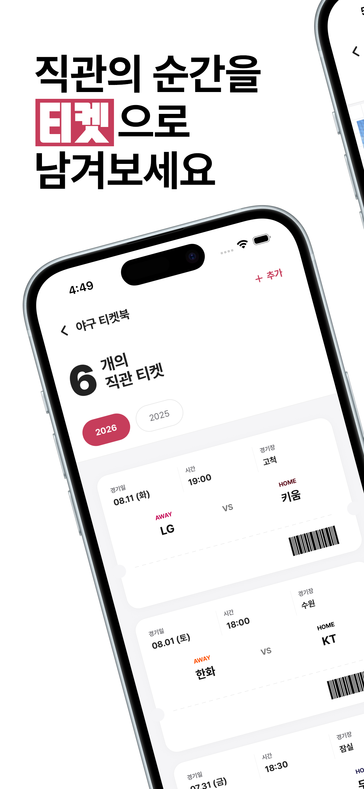
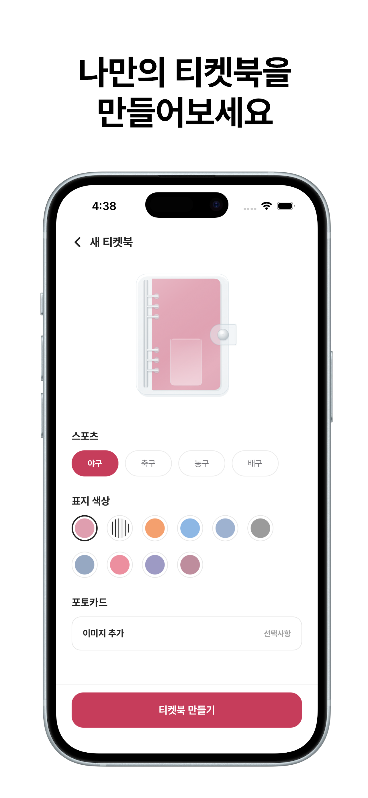
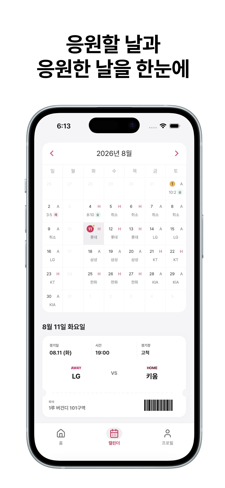
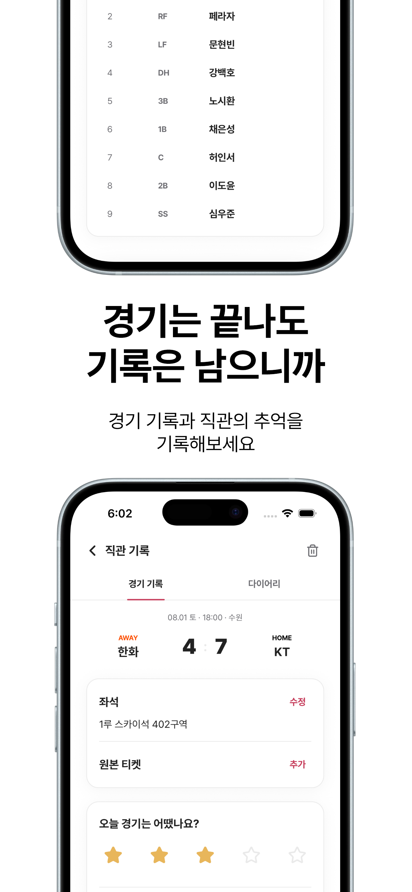

<p align="center">
  
</p>

<h1 align="center">스티켓</h1>

<p align="center">
  직관의 순간을 티켓처럼 남기는 iOS 스포츠 기록 앱
</p>

## 소개

스티켓은 스포츠팬이 현장에서 본 경기를 티켓으로 기록하고, 그날의 추억을 다이어리로 꾸밀 수 있는 React Native iOS 앱입니다. 경기 일정과 연동해 직관 기록을 간편하게 남기고, 캘린더와 시즌
통계로 나의 응원 여정을 다시 돌아볼 수 있습니다.

현재 MVP는 KBO 야구 기록을 지원하며, 이후 축구, 농구, 배구 등으로 확장할 예정입니다.

## 미리보기

<p align="center">
  
  
  
</p>

<p align="center">
  
  
</p>

## 지원 종목

| 종목 | 상태       |
|----|----------|
| 야구 | MVP 지원 중 |
| 축구 | 지원 예정    |
| 농구 | 지원 예정    |
| 배구 | 지원 예정    |

## 주요 기능

- **직관 티켓**: 경기, 경기장, 좌석, 라인업, 만족도, 메모와 경기장 음식을 기록합니다.
- **원본 티켓 보관**: 지류 티켓이나 모바일 티켓 이미지를 함께 저장합니다.
- **다이어리**: 사진, 스티커, 텍스트와 손그림으로 경기의 추억을 꾸밉니다.
- **캘린더**: 날짜별 우리팀 경기 일정과 직관 기록을 한눈에 확인합니다.
- **직관 통계**: 응원팀의 시즌 직관 경기 수와 승률을 보여줍니다.
- **버킷리스트**: 이루고 싶은 직관 목표를 추가하고 관리합니다.
- **소셜 로그인**: Apple 및 Google 계정으로 로그인하고 데이터를 동기화합니다.

## 기술 스택

| 영역             | 기술                                                 |
|----------------|----------------------------------------------------|
| App            | React Native 0.86, React 19, TypeScript            |
| Navigation     | React Navigation                                   |
| Server state   | TanStack Query                                     |
| Local state    | Zustand                                            |
| Backend        | Supabase Auth, PostgreSQL, Storage, Edge Functions |
| Native         | PencilKit, Image Crop Picker, Reanimated           |
| Test           | Jest, React Native Testing Library                 |
| Data collector | Playwright, GitHub Actions                         |

## 동작 구조

```text
React Native iOS App
├── Apple / Google OAuth
├── Supabase Auth
├── Supabase PostgreSQL + RLS
├── Supabase Storage
└── Supabase Edge Functions

GitHub Actions
└── Playwright KBO Collector
    └── 경기 일정·상태·라인업 동기화
```

서버 데이터는 TanStack Query로 조회 및 캐싱하고, 화면의 일시적인 편집 상태는 Zustand 또는 컴포넌트 상태로 관리합니다. 데이터 접근 로직은 도메인별 `features` 서비스에 모으고
Supabase
RLS로 사용자 데이터 접근을 제한합니다.

## 프로젝트 구조

```text
.
├── src/
│   ├── components/       # 공통 UI 컴포넌트
│   ├── config/           # 공개 클라이언트 설정
│   ├── features/         # 도메인별 API, 서비스와 타입
│   ├── lib/              # Supabase 클라이언트와 공통 유틸리티
│   ├── navigation/       # Stack 및 Bottom Tab 내비게이션
│   └── screens/          # 인증, 홈, 캘린더, 티켓과 다이어리 화면
├── collector/            # KBO 경기 데이터 수집기
├── supabase/
│   ├── functions/        # Edge Functions
│   └── migrations/       # 스키마, RLS와 Storage 마이그레이션
└── ios/                  # iOS 네이티브 프로젝트
```

## 시작하기

### 요구사항

- Node.js 22.11 이상
- npm
- iOS: macOS, Xcode, Ruby 3.4.10, CocoaPods

React Native 네이티브 개발 환경은 [공식 환경 설정 문서](https://reactnative.dev/docs/set-up-your-environment)를 참고하세요.

### 설치

```bash
git clone https://github.com/ji-silver/sticket.git
cd sticket
npm ci
```

iOS를 실행한다면 CocoaPods 의존성을 설치합니다.

```bash
bundle install
cd ios && bundle exec pod install && cd ..
```

### 실행

먼저 Metro를 실행합니다.

```bash
npm start
```

다른 터미널에서 iOS 앱을 실행합니다.

```bash
npm run ios
```

### 인증 설정

앱의 Supabase publishable key와 OAuth client ID는 공개 클라이언트 설정인 `src/config/publicConfig.ts`에서 관리합니다. Apple 또는 Google 로그인을 다른
앱 식별자나 Supabase 프로젝트로 실행하려면 다음 설정도 일치시켜야 합니다.

- Supabase Auth의 Apple·Google provider 설정
- Google OAuth의 iOS·Web client ID와 URL scheme
- Apple Developer의 Sign in with Apple capability
- iOS bundle identifier

관리자 키와 private key는 앱이나 Git 저장소에 포함하지 않습니다.

## 지원 환경

- iOS 15.1 이상
- PencilKit 기반 손그림 지원

## KBO 데이터 수집

`collector`는 Playwright로 KBO 경기 일정, 경기 상태와 라인업을 수집해 Supabase에 동기화합니다. 앱 개발만 할 때는 실행할 필요가 없습니다.

```bash
cd collector
npm ci
npx playwright install chromium
```

`collector/.env`에 다음 운영 비밀 값이 필요합니다.

```dotenv
SUPABASE_URL=
SUPABASE_SECRET_KEY=
```

```bash
npm run collect                    # 최근 경기 상태 수집
npm run collect:schedule:upcoming  # 예정 경기 일정 수집
npm run backfill                   # 과거 데이터 수집
npm test                           # 수집 로직 검사
```

운영 환경에서는 `.github/workflows/collect-kbo.yml`이 정해진 시간에 수집기를 실행합니다.

## 품질 확인

```bash
npm run lint
npm test -- --runInBand
```

현재 테스트는 인증, 프로필, 티켓북, 직관 기록, 버킷리스트와 다이어리 편집의 주요 동작을 검증합니다.